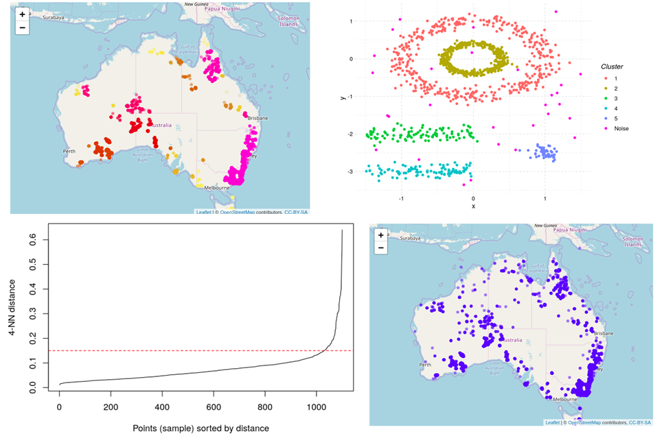

# Algoritma clustering DBSCAN

Artikel ini membahas salah satu metode clustering yaitu DBSCAN. metode DBSCAN merupakan metode clustering yang berbasis kepadatan (density-based) dari posisi amatan data dengan prinsip mengelompokkan data yang relatif berdekatan. DBSCAN sering diterapkan pada data yang banyak mengandung noise, hal ini dikarenakan DBSCAN tidak akan memasukkan data yang dianggap noise kedalam cluster manapun.

Objectif dari artikel ini yaitu :
* memahami cara kerja DBSCAN
* mampu menentukan parameter yang tepat untuk DBSCAN
* memvisualisasikan cluster
* mengimplemntasikan metode DBSCAN dalam pengelompokkan data kebakaran
* kelebihan serta kekurangan dari metode DBSCAN